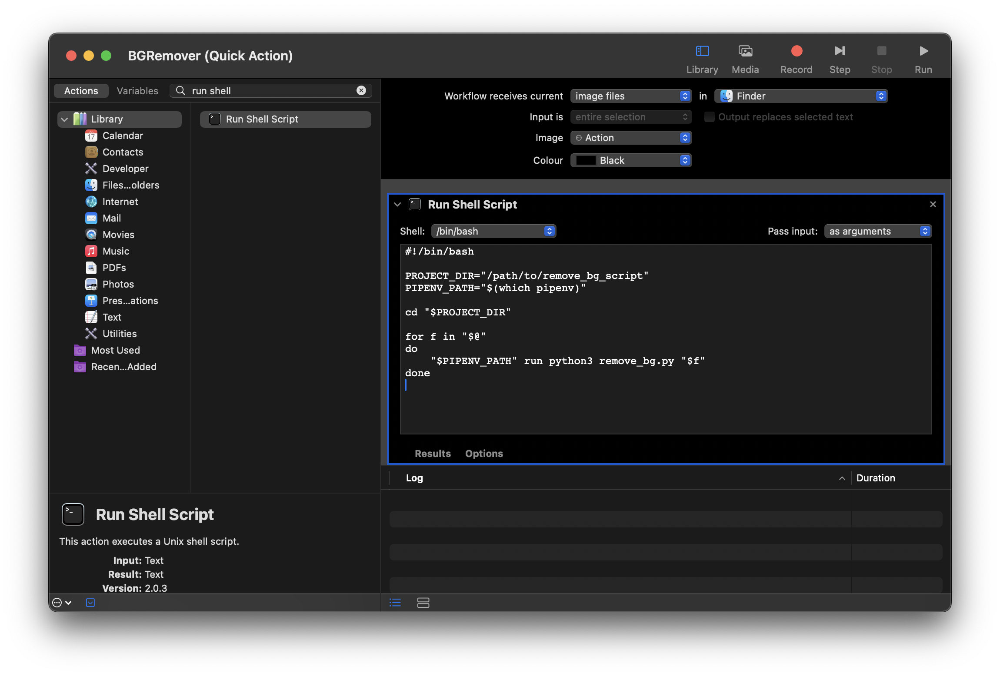

# BGRemover 

Remove background from images locally. It may not be the quickest, but it does have the most fine-grained control over the process.

> Note: Take a look at the example folder to see various images with their backgrounds removed.

## Installation

### Prerequisites

- Python 3.7+
- Pipenv

### Install Dependencies

```bash
pipenv install
```

Make the script executable:

```bash 
chmod +x remove_bg.py
```

Activate the Virtual Environment:

```bash
pipenv shell
exit
```

### Test the Script

```bash
./remove_bg.py ./example/shoe.jpg
```

## Usage 

### Mac

Use the Automator app to create a Quick Action that runs the script on selected images.



1. Open Automator via; `cmd + space` and search for Automator.
2. Select **"Quick Action"**
3. Configure Workflow Settings:
   - At the top, set "Workflow receives current" to image files.
   - Set "in" to Finder.
4. Add a "Run Shell Script" Action:
   - From the actions library, drag "Run Shell Script" into the workflow area.
5. Configure the Shell Script:
   - Set "Shell" to `/bin/bash`.
   - Set "Pass input" to as arguments.
   - Replace the default script content with the following, making sure to update the `PROJECT_DIR` with the full path to your project directory:
    ```bash
   #!/bin/bash

    PROJECT_DIR="/path/to/remove_bg_script"
    PIPENV_PATH="$(which pipenv)"
    
    cd "$PROJECT_DIR"
    
    for f in "$@"
    do
        "$PIPENV_PATH" run python remove_bg.py "$f"
    done
    ```
   _You may run `which pipenv` manually and replace it with the output._

6. **Save the Quick Action** - Go to `File` > `Save` and name it `BGRemover`.
7. **Test the Quick Action** - Right-click on an image file in Finder, navigate to Quick Actions, and select Remove BG. The script should process the image and remove its background.

### Windows

Todo